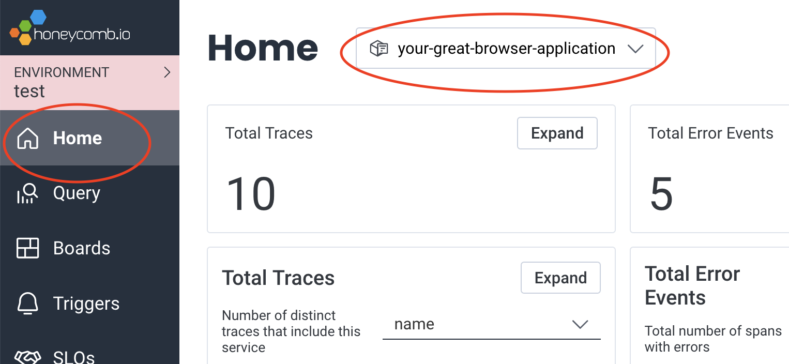

# Honeycomb OpenTelemetry Web

[](https://github.com/honeycombio/home/blob/main/honeycomb-oss-lifecycle-and-practices.md)
[](https://circleci.com/gh/honeycombio/honeycomb-opentelemetry-web)
[](https://www.npmjs.com/package/@honeycombio/opentelemetry-web)

Honeycomb wrapper for [OpenTelemetry](https://opentelemetry.io) in the browser.
<!-- TODO: happy badges of the OTel versions we are using -->
**STATUS: this library is ALPHA.**

Latest release:

* built with OpenTelemetry JS [Stable v1.19.0](https://github.com/open-telemetry/opentelemetry-js/releases/tag/v1.19.0), [Experimental v0.46.0](https://github.com/open-telemetry/opentelemetry-js/releases/tag/experimental%2Fv0.46.0), [API v1.7.0](https://github.com/open-telemetry/opentelemetry-js/releases/tag/api%2Fv1.7.0)
* compatible with OpenTelemetry Auto-Instrumentations for Web [~0.34.0](https://github.com/open-telemetry/opentelemetry-js-contrib/releases/tag/auto-instrumentations-node-v0.34.0)

This package sets up OpenTelemetry for tracing, using our recommended practices, including:

* Useful fields about the browser situation
* Easy configuration to send to Honeycomb
* Basic sampler to control event volume
* Convenient packaging
* An informative debug mode, including links to traces in Honeycomb

// TODO: ask Phillip whether we must call this a distro instead of a wrapper. It's a wrapper.

## Why use this?

This wrapper is a little ahead of OpenTelemetry, so that you can get the recommended fields in before they're completely standardized.

This wrapper is at least as stable as OpenTelemetry, because it is backwards-compatible as we update it to the latest OpenTelemetry versions, semantic conventions, and recommended practices.

We test this library, with its combination of OpenTelemetry dependencies, so that you can be confident that upgrades will work. It is tested with the latest versions of Chrome, Firefox, and Safari.

This project provides a convenient distribution of all the code required to get traces from the browser. No package manager is required. (note: maybe not in alpha)

## Getting started

Install this library:

`npm install @honeycombio/opentelemetry-web`

[Get a Honeycomb API key](https://docs.honeycomb.io/quickstart/#create-a-honeycomb-account).

Initialize tracing at the start of your application:

```js
import { HoneycombWebSDK } from '@honeycombio/opentelemetry-web';
import { getWebAutoInstrumentations } from '@opentelemetry/auto-instrumentations-web';

const sdk = new HoneycombWebSDK({
  apiKey: 'api-key-goes-here',
  serviceName: 'your-great-browser-application',
  instrumentations: [getWebAutoInstrumentations()], // add automatic instrumentation
});
sdk.start();
```

Build and run your application, and then look for data in Honeycomb. On the Home screen, choose your application from the dropdown at the top. Find some traces there.



## Configuration

Pass these options to the HoneycombWebSDK:

| name | required? | type | default value | description |
|------|-----------|------|---------------|-------------|
| *apiKey* | required[*](#send-to-an-opentelemetry-collector) |string| | [Honeycomb API Key](https://docs.honeycomb.io/working-with-your-data/settings/api-keys/) for sending traces directly to Honeycomb |
| *serviceName* | optional | string|unknown_service | The name of this browser application. Your telemetry will go to a Honeycomb dataset with this name. |
| *localVisualizations*| optional | boolean | false | For each trace created, print a link to the console so that you can find it in Honeycomb. Super useful in development! Do not use in production. |
| sampleRate | optional | number |1 | If you want to send a random fraction of traces, then make this a whole number greater than 1. Only 1 in `sampleRate` traces will be sent, and the rest never be created. |
| tracesEndpoint | optional | string|`${endpoint}/v1/traces` | Populate this to send traces to a route other than /v1/traces |
| debug | optional |boolean| false | Enable additional logging |
| tracesApiKey | optional |string| | If traces should go to a different place than metrics(?), put the traces-only API key here. | 
| dataset | optional |string| | Populate this only if your Honeycomb team is still [Classic](https://docs.honeycomb.io/honeycomb-classic/#am-i-using-honeycomb-classic) |
| skipOptionsValidation | optional | boolean | false | Do not require any fields.[*](#send-to-an-opentelemetry-collector) |

### Send to an OpenTelemetry Collector

`*` Note: the `apiKey` field is required because this SDK really wants to help you send data directly to Honeycomb.

In production, we recommend running an OpenTelemetry Collector, so that your browser app can send traces to its origin.
Your OpenTelemetry Collector can send the traces on to Honeycomb, and your API key will be in the Collector's configuration. Here is a configuration of the Honeycomb Web SDK that sends to your Collector:

```js
{
  endpoint: "/",
  serviceName: "your-spiffy-browser-application",
  skipOptionsValidation: true // because we are not including apiKey
}
```

## Fields emitted

What do you get from this SDK?

By default, no instrumentation is added.
You can configure [automatic instrumentation](https://docs.honeycomb.io/getting-data-in/opentelemetry/browser-js/#automatic-instrumentation).
You can also [add your own instrumentation](https://docs.honeycomb.io/getting-data-in/opentelemetry/browser-js/#adding-manual-instrumentation).

The SDK adds these fields to all telemetry:

| name | status | static? | description | example |
|------|--------|---------|-------------|---------|
| user_agent.original | [stable](https://github.com/scheler/opentelemetry-specification/blob/browser-events/specification/resource/semantic_conventions/browser.md) | static | window.user_agent | `Mozilla/5.0 (Macintosh; Intel Mac OS X 10_15_7) AppleWebKit/537.36 (KHTML, like Gecko) Chrome/95.0.4638.54 Safari/537.36` |
| browser.height | planned | per-span | `[window.innerHeight](https://developer.mozilla.org/en-US/docs/Web/API/Window/innerHeight)`, the height of the layout viewport in pixels | 287 |
| browser.brands | stable | static | [NavigatorUAData: brands](https://developer.mozilla.org/en-US/docs/Web/API/NavigatorUAData/brands) | ["Not_A Brand 8", "Chromium 120", "Google Chrome 120"] |
| browser.platform | stable | static | [NavigatorUAData: platform](https://developer.mozilla.org/en-US/docs/Web/API/NavigatorUAData/platform) | "Windows" |
| browser.mobile | stable | static | [NavigatorUAData: mobile](https://developer.mozilla.org/en-US/docs/Web/API/NavigatorUAData/mobile) | true |
| browser.language | stable | static | [Navigator: language](https://developer.mozilla.org/en-US/docs/Web/API/Navigator/language) | "fr-FR" |
| honeycomb.distro.version | stable | static | package version | "1.2.3" |
| honeycomb.distro.runtime_version | stable | static | | "browser"
| `entry_page.url`      | custom | static |   | `https://docs.honeycomb.io/getting-data-in/data-best-practices/#datasets-group-data-together?page=2` |
| `entry_page.path`     | custom | static |   | `/getting-data-in/data-best-practices/`                                                              |
| `entry_page.search`   | custom | static |   | `?page=2`                                                                                            |
| `entry_page.hash`     | custom | static |   | `#datasets-group-data-together`                                                                      |
| `entry_page.hostname` | custom | static |   | `docs.honeycomb.io`                                                                                  |

Static fields are added to the [Resource](https://opentelemetry.io/docs/concepts/resources/), so they are same for every span emitted for the loaded page.

Fields that can change during the lifetime of the page are instead added to each span in a SpanProcessor.

## When to stop using this

The parts of this wrapper are available separately.

You can copy the [initialization](the-relevant-code.js) of the SDK and customize it for yourself.

The UsefulBrowserFieldsSpanProcessor is available as a separate component. (or copy the code)

The sampler is available as a separate package. // link

The BaggageSpanProcessor is a separate package. // link

## Migration Practices

This wrapper can change faster than OpenTelemetry, and yet be more stable. This section describes how we do that.

### Versioning

Our version numbers are independent of the OpenTelemetry version numbers. Check the badge at the top of this README for the OpenTelemetry version this is based on.

When OpenTelemetry releases a new version of the packages this project depends on, we update this project to use them within a week, unless our tests indicate a problem.

When the OpenTelemetry API or SDK has a major version bump, this package will too. We also have major version bumps of our own.

### Code

If there is something we want to get into OpenTelemetry, or a PR that we wish were merged already, we can incorporate that code here in parallel to working to get it published upstream.

When that code is in place upstream, we remove it here, and release a new version. When there is no change to the inputs and outputs, nothing else is required.

### Fields

This project adds fields to the outgoing spans. We follow semantic convention when it exists.

For fields that aren't yet part of the semantic conventions, we give them a name. If those field names become stable with a different name, then:

1. We add the new name, and emit both for 6 months.
1. We mark the old name as deprecated in this documentation
1. We offer a configuration option to NOT emit both.
1. After that period, we add a configuration parameter to allow you to say, keep emitting that old field name.
1. A year after the semantic convention has been in place, we stop emitting the old field name at all. (at the next major version bump)

### Configuration

The configuration accepted by this wrapper is based on the options available in the OpenTelemetry libraries.

When an option is not available upstream, we give it a name. If that options becomes available upstream under a different name, we migrate to that.

1. We add the new name, and accept both for 6 months.
1. We mark the old name as deprecated in this documentation, and issue a warning in debug mode.
1. After this period, the old name will be ignored (at the next major version bump).

## Development

See [DEVELOPING.md](./DEVELOPING.md)

## Contributing

See [CONTRIBUTING.md](./CONTRIBUTING.md)

## Support

See [SUPPORT.md](./SUPPORT.md)

## Code of Conduct

See [CODE_OF_CONDUCT.md](./CODE_OF_CONDUCT.md)
